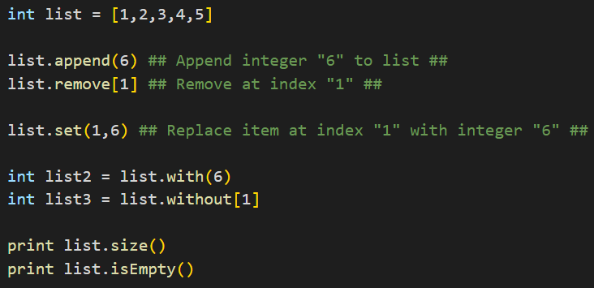
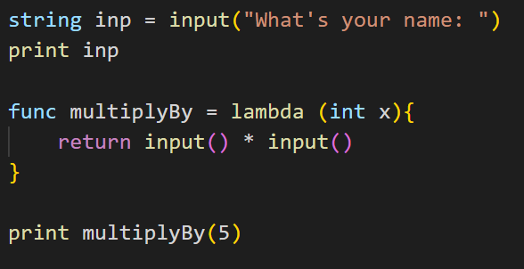
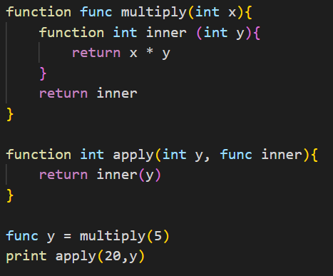
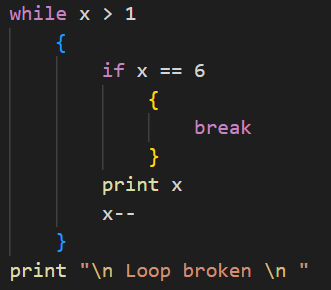
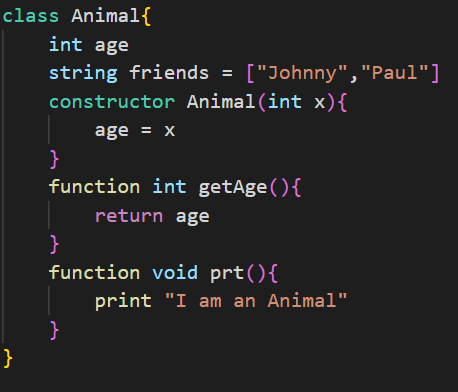

# Strator - Educational Programming Language
### Implemented in Java - using [BNF Converter](https://bnfc.digitalgrammars.com/ "BNF Converter") for Lexer / Parser generation in JFlex and JCup
## Introduction
__Strator__ is a programming language designed to assess and gain insights into student comprehension of programming language constructs, while enabling rapid development of education-oriented programming languages to match student needs.

## Language Features:
 * Paradigm selection (Functional) mode. Use the language in an experimental _functional_ mode, where you are restricted from using imperative constructs of the language
 * Runtime Errors, with some enhancements geared towards education
 * Primitive types
    * Integer
    * Double
    * Char
    * String
    * Boolean
 * Strong Typing
 * Type casting
 * Block scoping
 * Basic Operations
    * Adding, Subtracting, Multiplying, Dividing, Exponentiation
    * Modulo
    * Increment, Decrement
 * Print statements
 * Input expression with _input()_ keyword
 * Type inference
   * Using _auto_ keyword
 * Lists
   * Append
   * Remove at index
   * Sizeof
   * _.with()_ and _.without()_ element expressions
 * Functions
   * First-class
   * Closures
   * Lambdas
   * Map / Filter / Reduce functions
 * Object Orientation
    * Classes and constructors
    * Objects
    * Inheritance
 * If / Else statements
    * Equality, Inequality, Less-Than(Equal), Greater-Then(Equal) expressions
    * _AND_ / _OR_ operators
 * Loops
   * _While_ loop
   * _Repeat_ loop (C-Style _for_ loop)
   * _Repeat_ loop over a list
   * _Repeat in Range_ (Python _in range_ loop), with _start_, _stop_ and _end_ parameters
 * Continue, break, return statements
 * Random Integer generator function with _randomInt()_ function
 * Comments with __## ##__ tags

## Installation and Syntax Highlighter
Download _lang.jar_ and _strator.zip_ VSCode extension from the [Releases](https://github.com/bossmatt1234/stratorLang/releases "Releases") page.
* Make sure you have at least JDK17 installed
* Put the _lang.jar_ file in a suitable folder containing your text files
* Run the text files in the interpreter by running the following line of code in a terminal console:
```
    java -jar lang.jar code.txt
```
* To get Syntax highlighting, put the _Strator_ folder from _strator.zip_ into the VSCode extensions folder. Finally, create a file with the _.stra_ file type and open it in VSCode.
## Documentation
### Paradigm Functional mode


At the top of the program you can use the _paradigm : functional_ line of code to restrict the language to the functional subset.


If you try to use restricted constructs (mutating, classes, loops, etc.), you will get special error messages exclusive to this mode.
### Enhanced Error Messages


Here is an example of a mistyped function call. If you run this code, you will get an error message.


If you call an unidentified variable, function, object method / data, etc., the error will try to point you towards the most similar identifier in the context.
### Primitive Types, Variables and Printing 


Variables are Strongly-Typed, meaning that you need to specify the type of each variable when you initialise them.
To print a value or expression, use the _print_ statement. You can chain multiple values in the print statement by using the _+_ operator.
### List


List are specified in squared brackets. Some basic operation on lists include:
* appending to a list variable
* removing an item at an index of the variable list
* get the size of the list 
* return a new list with the added item of a list 
* return a new list with the removed item at an index of a list
### Input expression


The _input()_ expression interrupts the program and asks the user for an input.
### Type casting


Type casting can be done using the 5 possible casting functions:
* _toInt_
* _toDouble_
* _toString_
* _toChar_
* _toBool_
### Scoping


If you specify an independent instance of the __{__ __}__ braces, variables contained in it will not be available once the scope ends.
### If / Else Statements


If / Else statements check for true and false values of expressions such as x == y, x <= 10, etc. You can use _AND_ / _OR_ operators to check multiple boolean values.
### Functions


Functions and Lambdas provide the following functionalities:
* an output based on a set of inputs
* functions allow the easy grouping of multiple statement and operations
* being First-class, functions can be used as and assigned to variables
* functions store and can access the outer-scope variables using __closures__
* Return a value using the _return_ statement, which breaks the function body
#### Closure 


Using the closure, you can use and return inner functions and variables.
### Loops and iteration-specific statements
#### While loop


While loop repeats a series of statements until the given condition is true.
#### Repeat loop


Three steps are needed for the Repeat loop:
1. Initialise an iterator variable, usually an integer starting at zero
2. Specify the condition to be checked before repeating the statements, for example (i < 10)
3. Specify how the variable will change for each loop, for example (i++, i+=2)

The loop construct will continue until the condition is true. You can bypass the first step and work with local variables, but at the moment, the initialiser needs to be specified for the Lexer.
#### Repeat in List


This loop construct allows you to loop over items in a list.
#### Repeat in range


This loop construct allows you to loop an iterator in a specified range. The loop can be used in the following ways:
* By specifying only 1 parameter in the range function, the iterator will increment until it hits the specified parameter and then the loop breaks
* By specifying 2 parameters, the first parameter value will represent the starting number and the second parameter will represent the stop value at which the loop breaks
* By specifying 3 parameters, the thirst parameter will represent the value by which the iterator will change each loop iteration
You can use negative and positive numbers for each 3 parameters.
#### Break / Continue Statements
* The _break_ statement stops the loop in its tracks
* The _continue_ statement skips to the next iteration
Both these statements are usually used with conditional statements (if / else) to check for a suitable exit point in the loop
### Classes and Objects
#### Class Definition


Classes can bundle up variables with functions (also known as _methods_ when used in this context).
The Class definition allows the creation of objects, which can utilise and access the specified values and functions.
The _constructor_ is an optional construct that represents an instantiation function which is executed on object creation, allowing the binding of values to class-specific variables, and other operations.
#### Inheritance


A Class definition that includes the _inherits_ keyword will inherit the variables, constructor and variables specified in the parent class.
You can create additional methods that are exclusive to the child class, and you can override the parent constructor and methods by specifying them again.
#### Object instantiation


Object variables are instantiated with the _object_ keyword and the _new_ keyword and object call on the right side.
You can access methods and variables using the object name.
### Functional constructs
#### Map


The _map_ function applies a function over each list item and returns a newly modified list.
Functions need to have 1 single parameter specified for this construct.
#### Filter


The _filter_ function filters a given list based on the given function's return condition. 
Functions need to have 1 single parameter specified for this construct.
#### Filter


The _filter_ function filters a given list based on if the given function's boolean return value.
Functions need to have 1 single parameter specified for this construct.
#### Reduce


The _reduce_ function reduces the list to a single value using a given function that takes two parameters and returns a single value.
Functions need to have 2 parameter specified for this construct.
### Random number generator


You can generate a random integer using the _randomInt()_ function. You must specify the upper bound in the function's parameter.